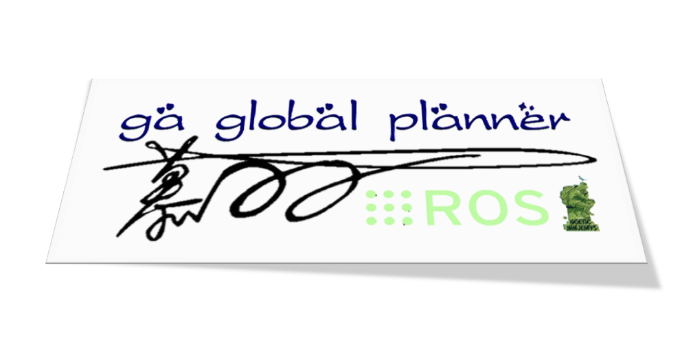
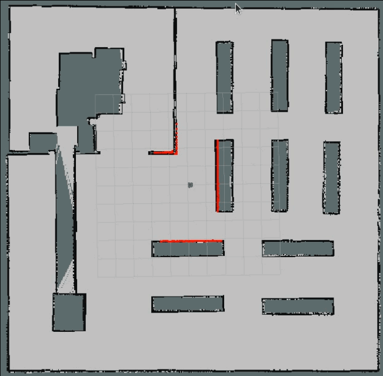
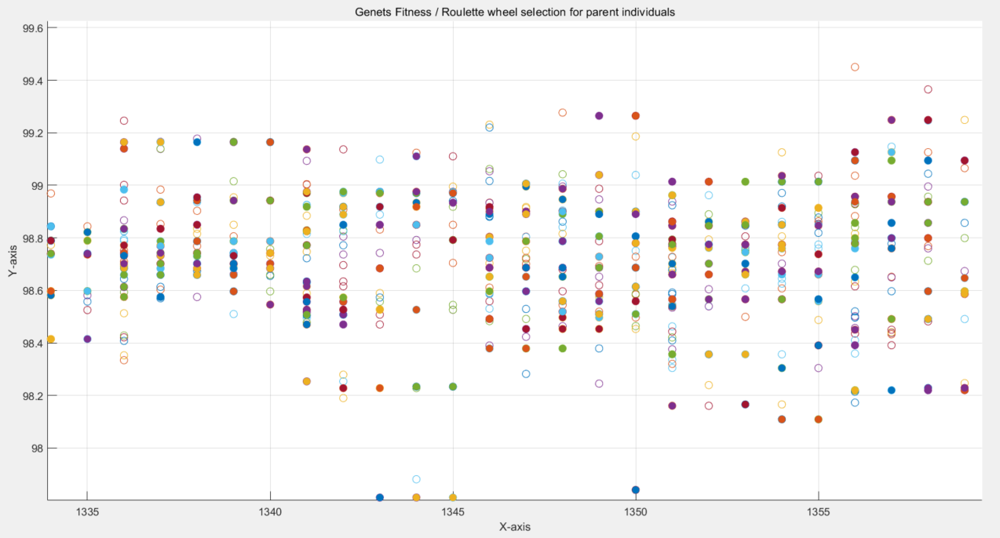
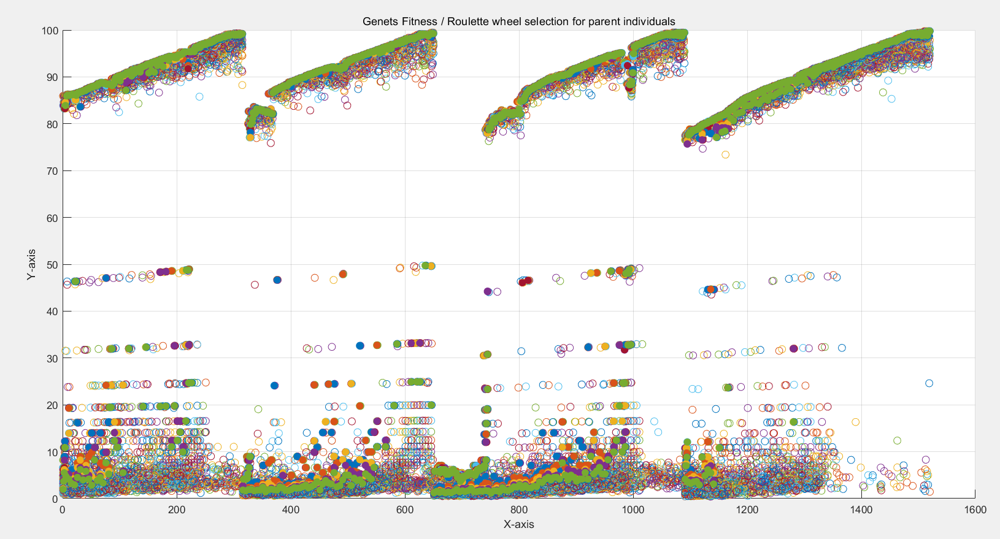

# GA Global Path Planner for ROS



<p align="center">
    
    
</p>

## 1. Introduction

This ROS Global Planner Plugin implements the GA (Genetic Algorithm) path planning algorithm. The examples below demonstrate its usage in dynamic environments:

<div align="center">
  
</div>


## 2. How to Use

### (1) Method One: Utilized as a ROS Global Planner Plugin.

You can employ this plugin within the ROS navigation package by configuring the global path planner plugin to `ga_planner/globalMotionPlannerROS` in the launch file where the 'move_base' node is situated. Additionally, load the parameter configuration file `ga_planner.yaml`. An example is provided below:

```bash
<node pkg="move_base" type="move_base" respawn="false" name="move_base" output="screen">

    <!-- Load other parameter configuration files -->
    ...
    ...
    ...

    <!-- Load GA Global Planner Parameters -->
    <rosparam file="$(find ga_global_planner)/params/ga_planner.yaml" command="load" />

    <!-- Set Global Path Planner Plugin -->
    <param name="base_global_planner" value="ga_planner/globalMotionPlannerROS" />

    <!-- Set other parameters such as local path planner plugin -->
    ...
    ...
    ...

</node>
```

### (2) Method Two: Employing through the ros_motion_planning library.

In addition to the method described above, which involves using it as an independent ROS global path planner plugin, we also offer an alternative approach. We have integrated the GA global path planner into the ROS-based motion planning library, [ros_motion_planning](https://github.com/ai-winter/ros_motion_planning). You can easily utilize it by setting the 'robot1_global_planner' parameter in the ['user_config.yaml'](https://github.com/ai-winter/ros_motion_planning/blob/master/src/user_config/user_config.yaml) file of this motion planning library to 'ga'. An example is provided below:

```bash
   map: "warehouse"
   world: "warehouse"
   rviz_file: "sim_env.rviz"

   robots_config:
     - robot1_type: "turtlebot3_waffle"
       robot1_global_planner: "ga"      <!-- Set the global path planning algorithm to GA -->
       robot1_local_planner: "dwa"

       <!-- Set other parameters -->
       ...
       ...
       ...

   plugins:

        <!-- Set other parameters -->
        ...
        ...
        ...
    
```

The demonstration of the results is as follows:

<div align="center">
   
   
</div>

<div align="center">
  
</div>
